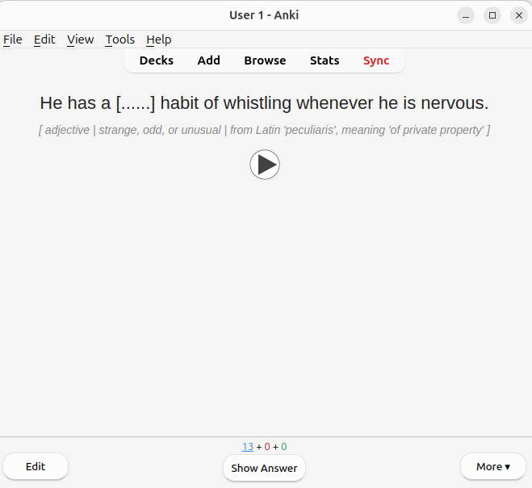
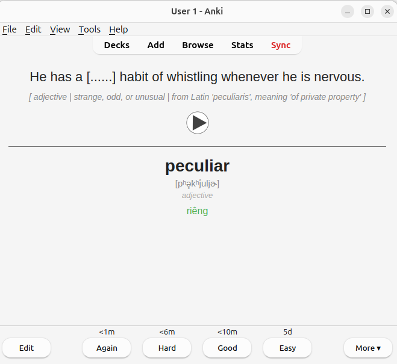

# anki-creation

Turns your Google Translate saved words export into a ready-to-study Anki deck — with IPA, audio, fill-in-the-blank sentences, and smart hints — fully automated.

## The user story, actually my story

I saved words for learning English using Google Translate while reading or browsing. But the export is a flat CSV:

```
English,Vietnamese,resilient,kiên cường
English,Vietnamese,ambiguous,mơ hồ
```

That's not enough to actually study from. I need context, pronunciation, and a format that makes me retrieve the word — not just recognise it.

## What this does

Takes that CSV and produces Anki cards in this format:

| Front | Back |
|---|---|
|  |  |

The front shows a fill-in-the-blank sentence with a layered hint: part of speech, an English synonym, and an optional etymology or metaphor note. The back reveals the word, IPA, part of speech, and Vietnamese translation.

For words with multiple common parts of speech (e.g. _conduct_ as noun and verb), it creates a separate card for each — keeping each card focused on one usage.

## Pipeline

```
saved_translations.csv
        │
        ▼
  Phase 1 — Enrich
  ├── Free Dictionary API  →  IPA + audio download
  └── LLM (Gemini)         →  example sentence + synonym hint + structure hint
        │
        ▼
  Phase 2 — Push to Anki
  ├── AnkiConnect           →  creates/updates VocabPro note type
  ├── addNotes              →  uploads audio (base64) + creates cards
  └── sync                  →  pushes to AnkiWeb → available on AnkiDroid
```

## Requirements

- [Anki Desktop](https://apps.ankiweb.net/) with [AnkiConnect](https://ankiweb.net/shared/info/2055492159) add-on (ID: `2055492159`)
- You can find all apis here: [~foosoft/anki-connect](https://git.sr.ht/~foosoft/anki-connect)
- AnkiWeb account (for mobile sync)
- Google Gemini API key (`GEMINI_API_KEY`)

## Setup

```bash
cp .env.example .env
# fill in your API keys
```

```env
GEMINI_API_KEY=your_key
LLM_MODEL=gemini-2.0-flash
DICTIONARY_FREE_IPA_BASE_URL=https://api.dictionaryapi.dev/api/v2/entries/en/
```

Then open Anki Desktop (must be running), and:

```bash
go run .
```

Cards land in a deck called `vocabulary`, tagged by language pair and part of speech (`en-vi`, `noun`, `verb`, etc.).

## Card note type

The `VocabPro` note type is created automatically on first run and updated on subsequent runs. Fields:

| Field            | Content                                |
| ---------------- | -------------------------------------- |
| `Word`           | The target word                        |
| `IPA`            | Phonetic transcription                 |
| `Part_of_Speech` | noun / verb / adjective…               |
| `Definition_VI`  | Vietnamese translation                 |
| `Sentence_Front` | Example sentence with `[......]` blank |
| `Synonym_Hint`   | English synonym or paraphrase          |
| `Structure_Hint` | Etymology or metaphor note (optional)  |
| `Audio`          | Pronunciation MP3                      |

## Todo

- [ ] This is not handle the duplicate words, if I import the same csv file again, it will create the same cards again.
- [ ] Maybe I should handle the duplicate words in the AnkiConnect level.
- [ ] Maybe there is more cases I haven't considered, you can improve this project based on your experience.


